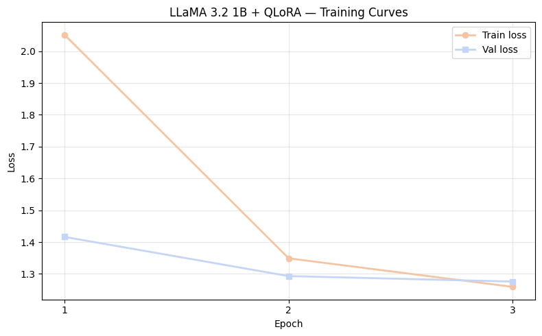
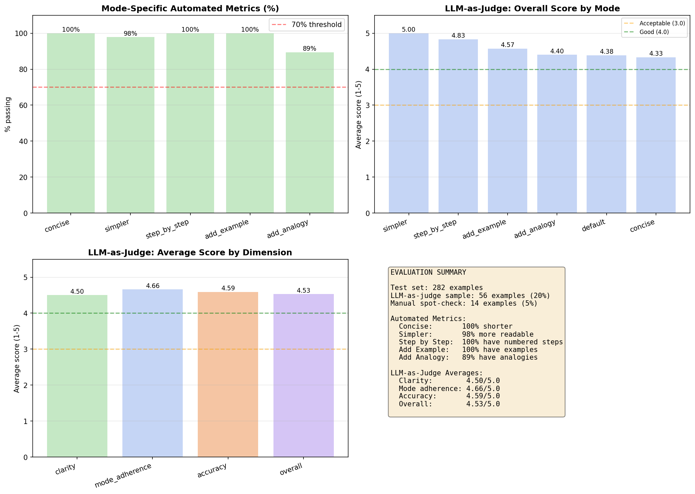
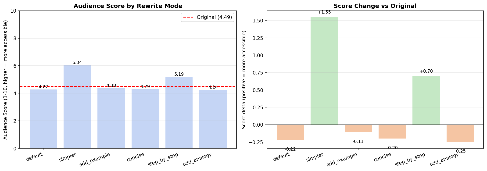
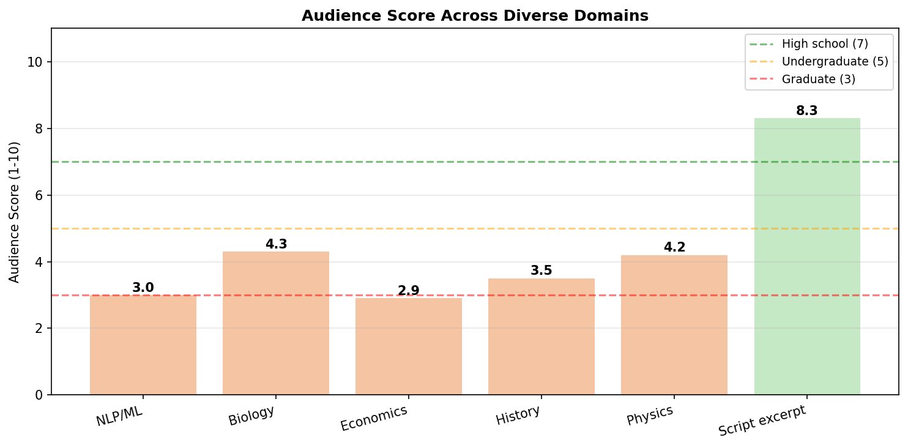

# Phase 5 — Educational Rewriter GPT

## Overview

This phase documents the development of a fine-tuned language model designed to rewrite confusing educational content into clearer, more accessible alternatives. The model supports six targeted rewrite modes and includes an audience suitability scoring system that indicates the accessibility level of any rewrite on a 1-10 scale.

The model serves as the core inference engine for the Teaching Quality Analyzer capstone project and is published independently as a reusable NLP component on HuggingFace Hub.

The complete pipeline covers dataset curation, synthetic data generation, model fine-tuning, three-method evaluation, audience scoring, and deployment.

---

## Model

| Property | Value |
|----------|-------|
| **Base model** | meta-llama/Llama-3.2-3B |
| **Fine-tuning method** | QLoRA (4-bit quantisation + LoRA) |
| **LoRA rank** | 16 |
| **LoRA alpha** | 32 |
| **Target modules** | q_proj, v_proj, k_proj, o_proj |
| **Trainable parameters** | 3,407,872 (0.45% of total) |
| **Training examples** | 846 |
| **Training time** | 150 minutes (NVIDIA Tesla T4) |
| **HuggingFace model** | [ray-2908/educational-rewriter-lora](https://huggingface.co/ray-2908/educational-rewriter-lora) |
| **HuggingFace dataset** | [ray-2908/educational-rewriter-dataset](https://huggingface.co/datasets/ray-2908/educational-rewriter-dataset) |
| **License** | Apache 2.0 |

---

## Rewrite Modes

| Mode | Description | Use case |
|------|-------------|----------|
| **Default** | General clarity improvement | Any dense or poorly structured text |
| **Simpler** | Jargon removal, plain language | Non-expert or younger audiences |
| **Add Example** | Adds a domain-relevant concrete example | Abstract concepts that need grounding |
| **Concise** | Reduces word count, preserves meaning | Verbose or repetitive content |
| **Step by Step** | Breaks mechanism into numbered steps | Processes, algorithms, how-to content |
| **Add Analogy** | Adds a real-world comparison | Abstract or counterintuitive concepts |

---

## Repository Structure

```
05_rewriter_gpt/
├── README.md
├── concepts/
│   └── 01_educational_rewriter.md     — Full concept notes covering all Phase 5 decisions
├── data/
│   ├── raw/
│   │   ├── passages.json              — 201 raw collected passages
│   │   └── passages_clean.json        — 141 cleaned passages (66 Wikipedia + 75 arXiv)
│   ├── processed/
│   │   ├── rewrites.json              — 846 (input, mode, output) training triplets
│   │   └── dataset/                   — HuggingFace Dataset format
│   │       ├── train/                 — 612 examples (70%)
│   │       ├── validation/            — 138 examples (17%)
│   │       └── test/                  — 96 examples (13%)
│   └── jargon/
│       ├── word_frequencies.json      — Full word frequency data (10,418 words)
│       ├── jargon_scores.json         — Lightweight jargon scores for inference
│       └── frequency_distribution.png — Tier distribution visualisation
├── demos/
│   ├── 01_collect_passages.ipynb      — Wikipedia + arXiv passage collection
│   ├── 02_generate_rewrites.ipynb     — Claude API rewrite generation
│   ├── 03_finetune_llama.ipynb        — QLoRA fine-tuning on Kaggle (T4 GPU)
│   ├── 04_jargon_frequency_list.ipynb — Simple English Wikipedia jargon system
│   ├── 05_evaluation.ipynb            — Three-method model evaluation
│   └── 06_audience_score.ipynb        — Audience score formula and inference function
├── results/
│   ├── training_curves.png            — Train and validation loss across 3 epochs
│   ├── evaluation_results.png         — Automated metrics and LLM-as-judge charts
│   ├── audience_score_by_mode.png     — Audience score delta across all 6 modes
│   └── diverse_domain_scores.png      — Audience score across 6 subject domains
└── inference.py                       — Standalone inference module for capstone import
```

---

## Pipeline

### Step 1 — Dataset Collection

**Notebook:** `demos/01_collect_passages.ipynb`

Collected 141 confusing educational passages from two sources:

- **Wikipedia** (66 passages) — Technical article sections across computer science, biology, physics, mathematics, economics, chemistry, and medicine. Filtered for density, sentence length, and absence of markup artifacts.
- **arXiv** (75 passages) — Academic paper abstracts across machine learning, NLP, quantum computing, economics, and statistics. Naturally dense and jargon-heavy.

Passages were filtered for length (30-300 words), duplicate removal, and quality before proceeding to generation.

### Step 2 — Synthetic Data Generation

**Notebook:** `demos/02_generate_rewrites.ipynb`

Each passage was rewritten in all 6 modes using the Claude API (claude-sonnet-4-5), following the synthetic data generation methodology established in Stanford Alpaca (Taori et al., 2023).

Key design decisions:
- **Dynamic prompting:** Each example was randomly assigned either a short or detailed system prompt (49% / 51% split), exposing the model to both instruction styles during training.
- **Auto-save with resume:** The generation script saved progress after every passage, enabling safe resumption on interruption.
- **Stratified split:** Dataset split at passage level so all 6 modes for a given passage go to the same split, preventing data leakage.

**Generation statistics:**

| Metric | Value |
|--------|-------|
| Total API calls | 846 |
| Total tokens | 401,756 (242,618 input + 159,138 output) |
| Total cost | $3.12 |
| Concise mode check | 141/141 outputs shorter than input |
| Step by Step check | 77/141 outputs contained numbered steps |

### Step 3 — Fine-tuning

**Notebook:** `demos/03_finetune_llama.ipynb`
**Platform:** Kaggle (NVIDIA Tesla T4, 16GB)

Fine-tuned LLaMA 3.2 3B using QLoRA via TRL's SFTTrainer. The base model was loaded in 4-bit NF4 quantisation, reducing memory from approximately 12GB to under 2GB. LoRA adapters were applied to all four attention projection layers.

**Training configuration:**

| Hyperparameter | Value |
|----------------|-------|
| Epochs | 3 |
| Learning rate | 2e-4 (cosine schedule) |
| Batch size | 2 + gradient accumulation 8 |
| Effective batch size | 16 |
| LoRA rank | 16 |
| LoRA alpha | 32 |
| LoRA dropout | 0.05 |
| Target modules | q_proj, v_proj, k_proj, o_proj |
| Max sequence length | 512 |
| Training precision | BFloat16 |

**Training results:**

| Epoch | Training Loss | Validation Loss |
|-------|--------------|-----------------|
| 1 | 1.737 | 1.183 |
| 2 | 1.149 | 1.086 |
| 3 | 1.044 | 1.065 |

Train/validation gap at epoch 3: **0.021** — indicating minimal overfitting.



**Note:** LLaMA 3.2 1B was attempted first. Output quality was insufficient across all modes — the 1B scale is below the threshold for reliable multi-mode instruction following. The 3B model was adopted as the base.

### Step 4 — Jargon Detection System

**Notebook:** `demos/04_jargon_frequency_list.ipynb`

Built a domain-agnostic jargon detection system using Simple English Wikipedia as a frequency benchmark. Supplemented with the Dolch word list and Fry word list to cover common everyday words underrepresented in the science-focused Wikipedia corpus.

**Corpus:** 59 articles, 112,433 words.

**Tier thresholds:**

| Tier | Frequency | Jargon score | Words | % of vocabulary |
|------|-----------|--------------|-------|-----------------|
| Common | 50+ | 0.0 | 789 | 7.6% |
| Familiar | 10-49 | 0.3 | 993 | 9.5% |
| Technical | 2-9 | 0.7 | 4,042 | 38.8% |
| Jargon | <2 | 1.0 | 4,594 | 44.1% |

**Validation:**

| Text | Jargon density | Tier |
|------|---------------|------|
| "The dog sat in the park" | 0.222 | Familiar |
| "Photosynthesis is the process by which plants make food" | 0.067 | Common |
| "Backpropagation computes gradients via chain rule" | 0.580 | Technical |
| "The eigendecomposition of the Hessian matrix" | 0.555 | Technical |

### Step 5 — Evaluation

**Notebook:** `demos/05_evaluation.ipynb`

Three evaluation methods were applied to the test set (96 examples).

#### Automated Mode-Specific Metrics

| Mode | Metric | Result |
|------|--------|--------|
| Concise | Outputs shorter than input | 100% |
| Concise | Average length ratio | 0.54 (46% reduction) |
| Simpler | Readability improved (FK grade) | 98% |
| Simpler | Average FK grade reduction | 4.78 grades |
| Step by Step | Outputs with numbered steps | 100% |
| Add Example | Outputs with example phrases | 100% |
| Add Analogy | Outputs with analogy phrases | 89% |

All modes exceeded the 70% passing threshold.

#### LLM-as-Judge (20% of test set — 56 examples)

| Dimension | Score |
|-----------|-------|
| Clarity | 4.50/5.0 |
| Mode Adherence | 4.66/5.0 |
| Accuracy | 4.59/5.0 |
| Overall | 4.53/5.0 |

**Per mode (overall score):**

| Mode | Score |
|------|-------|
| Simpler | 5.00/5.0 |
| Step by Step | 4.83/5.0 |
| Add Example | 4.57/5.0 |
| Add Analogy | 4.40/5.0 |
| Default | 4.38/5.0 |
| Concise | 4.33/5.0 |

All modes above the 4.0 threshold.

#### Manual Spot-Check (5% of test set — 14 examples)

Strong examples: Simpler (autoimmune disease), Step by Step (black holes), Add Example (Java code generation), Step by Step (fluid dynamics).

Weaker examples: Add Example mode occasionally introduced specific technical details not present in the original passage.



**Key finding:** Initial qualitative testing on a single passage suggested 4/6 modes working. LLM-as-judge evaluation across 56 diverse examples showed all 6 modes performing above the 4.0 threshold. Single-passage testing underestimated model performance at scale.

### Step 6 — Audience Suitability Score and Inference

**Notebook:** `demos/06_audience_score.ipynb`

A formula-based 1-10 score computed from the rewritten text at inference time. No additional model required — computed purely from text features.

**Scale:**
```
1  — Expert / researcher level
3  — Graduate level
5  — Undergraduate level
7  — High school level
10 — Accessible to a curious 10-year-old
```

**Formula:**
```
Score = readability (40%) + jargon density (25%) +
        sentence complexity (20%) + concept density (15%)
```

**Score delta across modes (average input score: 4.49/10):**

| Mode | Score | Delta |
|------|-------|-------|
| Simpler | 6.04/10 | +1.55 |
| Step by Step | 5.19/10 | +0.70 |
| Add Example | 4.38/10 | -0.11 |
| Default | 4.27/10 | -0.22 |
| Concise | 4.29/10 | -0.20 |
| Add Analogy | 4.24/10 | -0.25 |

**Diverse domain testing:**

| Domain | Score | Audience |
|--------|-------|---------|
| Script excerpt | 8.3/10 | High school |
| Biology | 4.3/10 | Graduate |
| Physics | 4.2/10 | Graduate |
| History | 3.5/10 | Graduate |
| NLP/ML | 3.0/10 | Graduate |
| Economics | 2.9/10 | Expert |

**Iterative simplification loop:** The audience score triggers a pop-up recommendation when below 8.0. Users can click "Show Me" to apply Simpler mode iteratively until their target audience level is reached.




---

## Inference

```python
from inference import load_model, rewrite
from inference import compute_audience_score, simplify_until_accessible

# Load model
model, tokenizer = load_model()

# Generate rewrite with audience score
result = rewrite(model, tokenizer, text, mode="simpler")
print(result["rewrite"])
print(result["output_score"])    # audience score 1-10
print(result["recommendation"])  # simplification suggestion or None

# Iterative simplification
history = simplify_until_accessible(model, tokenizer, text, target_score=7.0)
```

See `inference.py` for the complete module including all 6 mode-specific system prompts, audience score formula, and iterative loop implementation.

---

## Known Limitations

**Add Example mode** occasionally introduces specific details not present in the original text. Proposed fix: regenerate Add Example training pairs with stricter domain-matching constraints.

**Simpler mode** occasionally retains technical vocabulary from the source text. Proposed fix: regenerate Simpler training pairs with explicit jargon elimination requirements.

**Model size:** At 3B parameters, outputs are generally coherent but may degrade on highly complex or very long inputs. Upgrading to 7B is the natural next step.

**Factual accuracy:** All outputs should be reviewed before publication in high-stakes contexts.

**Language:** English only.

---

## Future Work

1. Regenerate Add Example and Simpler training pairs with stricter constraints and retrain (~$0.50 + 2.5 hours)
2. Upgrade base model to LLaMA 3.2 7B for improved instruction following
3. Expand training dataset to 2,000+ examples for better generalisation
4. Mode-specific LoRA adapters — separate adapter per mode for higher per-mode quality

---

## Dependencies

```bash
pip install transformers peft accelerate bitsandbytes trl datasets sentencepiece huggingface_hub anthropic
```

---

## Related Resources

- **HuggingFace model:** [ray-2908/educational-rewriter-lora](https://huggingface.co/ray-2908/educational-rewriter-lora)
- **HuggingFace dataset:** [ray-2908/educational-rewriter-dataset](https://huggingface.co/datasets/ray-2908/educational-rewriter-dataset)
- **Capstone project:** [teaching-quality-analyzer](https://github.com/ray-2908/teaching-quality-analyzer) *(coming soon)*
- **Base model:** [meta-llama/Llama-3.2-3B](https://huggingface.co/meta-llama/Llama-3.2-3B)
- **LoRA paper:** [Hu et al., 2021](https://arxiv.org/abs/2106.09685)
- **QLoRA paper:** [Dettmers et al., 2023](https://arxiv.org/abs/2305.14314)
- **Alpaca methodology:** [Taori et al., 2023](https://crfm.stanford.edu/2023/03/13/alpaca.html)

---

## Citation

```bibtex
@misc{ray2026rewriter,
  author    = {Anisha Ray},
  title     = {Educational Content Rewriter — LLaMA 3.2 3B LoRA},
  year      = {2026},
  url       = {https://huggingface.co/ray-2908/educational-rewriter-lora}
}
```

---
